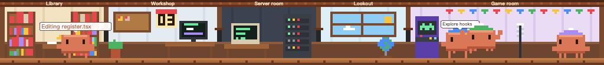
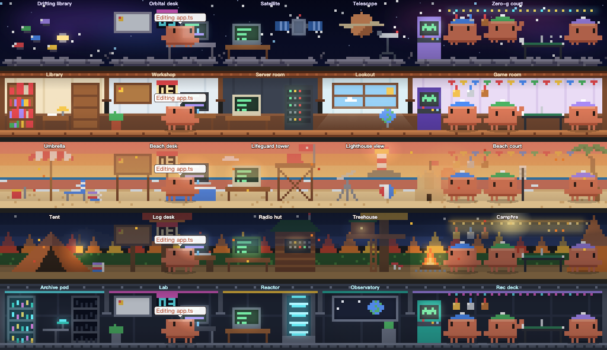
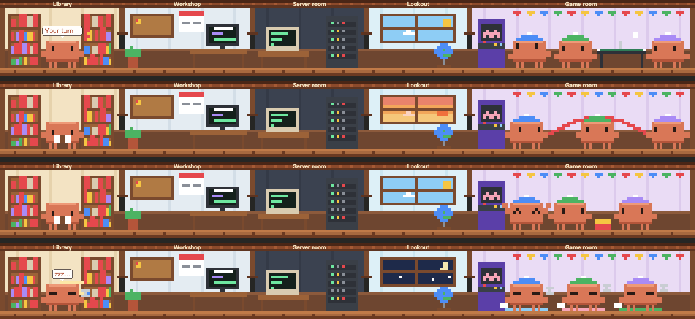
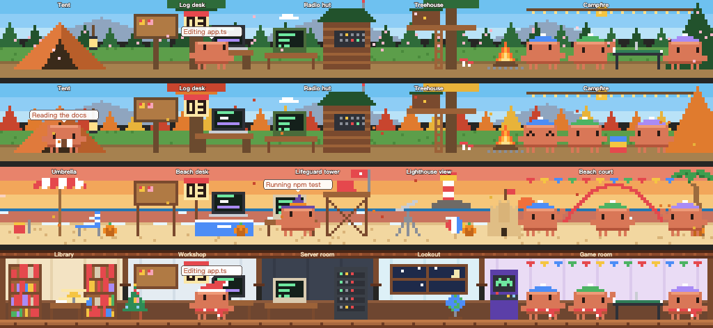
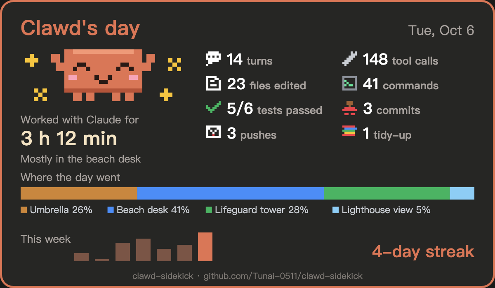

# Clawd Sidekick

**A pixel house for Clawd above your Claude Code prompt.** Clawd walks to the room of whatever Claude is doing, while his crew plays in the game room. Under the house you get the figures you'd normally check the status line for, and a list of things Claude handed **you** to do.

[繁體中文說明](./README.zh-TW.md)



## What you get

**The house.** It's a cross-section of five rooms, inspired by [ClawLibrary](https://github.com/shengyu-meng/ClawLibrary)'s pixel archive for OpenClaw:

| Room | Clawd goes there when Claude… |
| --- | --- |
| Library | reads or searches files |
| Workshop | edits files or thinks; your to-dos and the next deadline hang on the wall |
| Server room | runs a command |
| Lookout | searches or fetches the web (the window follows your local time: day, dusk, starry night) |
| Game room | is idle: the crew lives here |

**Four scenes.** Switch them with the **Scene** button on the band, or with `/clawd scene beach`. Every scene keeps the same five zones, so Clawd and the crew behave the same anywhere:

- **House**: library, workshop, server room, lookout, game room
- **Beach**: umbrella, beach desk, lifeguard tower, lighthouse view, beach court with a sandcastle
- **Space station**: archive pod, lab, reactor, observatory, rec deck
- **Forest camp**: tent, log desk, radio hut, treehouse, campfire



**The crew.** Three Clawds in blue, green and purple beanies:

- play **volleyball** while Claude works
- take turns at **ping-pong + arcade**, **jump rope** and a **block tower** while it waits (a new game every 90 s)
- sleep under blankets from 11 pm to 7 am
- **lend a player to every subagent**: one puts the game down, walks to the room of the subagent's tool calls with a speech bubble, and comes back when it's done. The others switch to a game that fits who's left.



**The scene shows what's really happening.** You can read the session from the scene alone, in every scene:

- **Claude's memory is the library.** As the context fills, books fill the house's shelves (and pile up on the floor), the station's data crystals light up one by one, and the book pile grows on the beach and at the camp. When the conversation is compacted, Clawd carries an armful of books off and the shelves empty out.
- **Test runs**: when `npm test`, `pytest`, `go test`, `cargo test` or the like passes, Clawd cheers; when it fails, he sweats.
- **Git**: a commit gets a red stamp, and a push or a new pull request goes off as a sealed envelope. A merged pull request gets a cheer. Claude Code tells the mod what git and gh did, so nothing is guessed from the output.
- **Waiting for your permission**: Clawd holds a big "?" sign up to the glass.
- **Late in the five-hour window** (past 80%), every Clawd gets heavy eyelids and yawns now and then.


**Seasons and holidays.** The scenes follow the calendar wherever you are, with no network:

- **Seasons**, from your local date: blossoms and drifting petals in spring, a red-and-gold forest and falling leaves in autumn, scarves on every Clawd in winter. South of the equator the seasons turn over: your system time zone (`Australia/Sydney`, `America/Sao_Paulo`) tells Clawd which side you're on.
- **Holidays**: lanterns for Lunar New Year, pumpkins and a witch's hat for Halloween, a tree and a Santa hat for Christmas.



**Hover everything.** In the Desktop app, a Clawd under the pointer hops and shows hearts, and his tooltip says what he's doing. The board lists your to-dos and the calendar names the deadline. Each scene's light switches on, and its toy says hi: the arcade, a crab peeking out of the sandcastle, or sparks from the campfire. In the terminal, the line under the house tells you what's under the pointer, and a click pets that Clawd.

With reduced motion turned on in your system settings, the Desktop scene holds still: no loops, no drifting clouds or leaves.

**A Clawd spinner.** The `Thinking…` line becomes a small Clawd who thinks in dots, then sits down at a laptop and types away while Claude works, beside a clock that counts every second.

**Clawd's day.** `/clawd recap` (or **Today** in the `/clawd` pane) shows a card of the day so far: how long Clawd worked alongside Claude, turns, tool calls, files edited, commands, tests passed, commits, pushes and tidy-ups, where the day went room by room, the week, and your streak of days in a row. It counts every session and project on the machine, and it's made to be screenshotted and shared.



**Live figures** under the house: model, context fill, 5-hour and 7-day plan usage, session cost, the turn timer, and this turn's tool calls, edits and commands. Each turns yellow past 50% and red past 80%.

**The human's half.** When a reply hands you something only you can do, such as creating an API key, uploading a file or signing up for something, a small model notes it on the board. The list carries across sessions and projects. You tick items off with □ (or the keys 1–3), or use `/todo`.

**Deadline radar.** `/deadline add 12/24 Launch` puts a countdown on the band and the wall calendar. With under 3 days left Clawd sweats; under 24 hours the calendar flashes red and he panics.

**English and 繁體中文.** It follows your system language. Switch any time with the button on the band or `/clawd lang en|zh|auto`.

## Install

You need Claude Code with mods: **v2.1.287+** in the terminal, or **v2.1.286+** in the Desktop app's Code tab. Tested on 2.1.288.

```bash
claude plugin marketplace add Tunai-0511/clawd-sidekick
claude plugin install clawd-sidekick@clawd-sidekick
```

Or from inside a session:

```
/plugin install clawd-sidekick --marketplace Tunai-0511/clawd-sidekick
```

Run `/reload-plugins` in an open session, or start a new one.

### Get updates automatically

Third-party marketplaces don't auto-update by default, and a marketplace can't switch that on for you. Turn it on once: run `/plugin`, open **Marketplaces**, choose **clawd-sidekick**, and select **Enable auto-update**. New versions then download in the background and load the next time you start Claude Code. Without it, run `claude plugin update clawd-sidekick@clawd-sidekick` when you want the latest.

## Commands

| Command | What it does |
| --- | --- |
| `/clawd` | Open the Clawd Sidekick pane: big Clawd, your full to-do list, all deadlines |
| `/clawd recap` | Today's card: time worked, the figures, the rooms, the week and your streak |
| `/clawd scene house` · `beach` · `space` · `forest` · `next` | Move the Clawds to another scene |
| `/clawd season winter` · `auto` | Set the season by hand, or follow the date |
| `/clawd holiday christmas` · `lunar` · `halloween` · `none` · `auto` | Set the decorations by hand, or follow the date |
| `/clawd hide` · `/clawd show` | Fold the band to one line, or unfold it |
| `/clawd lang en` · `zh` · `auto` | Switch language (`auto` follows the system) |
| `/todo` | List your to-dos; also `add <text>`, `done N`, `undo`, `rm N`, `clear` |
| `/deadline` | List deadlines; also `add 12/24 Name`, `add 2027-03-01 09:00 Name`, `add tomorrow Name`, `rm N` |

## Settings

These are in `/config`, under the plugin:

| Setting | Default | |
| --- | --- | --- |
| `autoTodo` | `true` | Note the to-dos Claude hands you |
| `todoModel` | `haiku` | Model that reads a reply for to-dos |
| `language` | `auto` | `auto`, `en` or `zh-TW` |

## What it does on your machine

A mod runs with your permissions, so here is everything this one reaches (`claude plugin validate .` lists the same):

- **Model calls**: only after a turn whose reply looks like it hands you something ("you'll need to…", "please upload…"), one short call to `todoModel`. Nothing else calls a model.
- **Processes**: `date +%z` and `readlink /etc/localtime` once at start, for your time zone and which way the seasons run; `defaults read -g AppleLanguages` once, on macOS, when the language is `auto` and no `LANG` is set.
- **Storage**: your to-dos, deadlines, scene, language, pet count and each day's figures for the recap, in the plugin's own store on your machine.
- **Environment**: reads `LANG`, `LC_ALL`, `LC_MESSAGES` and `TZ`.
- **Network: none.**

## How it works

- `hooks/themes.ts` draws the four scenes procedurally on a 256 × 28 canvas (`hooks/pixels.ts`). `hooks/scene.ts` adds the Clawds, the crew's places in each game, and what the pointer finds.
- **Desktop app**: `hooks/scene-svg.ts` turns it into one interactive SVG in three layers. The still scene is drawn once. Each of the scene's moving parts loops as a SMIL flipbook of only the pixels that change, and the game being played is a layer of its own, so their periods never multiply. Walking is `animateTransform`, and hovering is CSS `:hover` and `<title>`. `color-scheme: light dark` on the root keeps the frame transparent on any theme. When the system asks for reduced motion, every loop holds its first frame and nothing drifts.
- **Terminal**: `hooks/scene-client.tsx` is a `Client` surface module with its own frame clock. It draws two pixels per cell with `▀`, and its camera follows Clawd across a crop of up to 150 columns.
- `hooks/decor.ts` adds the holidays and the falling petals and leaves; `hooks/seasons.ts` works out the season and the holiday; `hooks/events.ts` turns a finished command into a moment (a test run, a commit, a push, a pull request).
- `hooks/i18n.ts` holds every string in both languages.

## Develop

```bash
claude --plugin-dir .          # load this folder for one session; edits hot-reload
claude plugin validate .
claude plugin test .
```

Type declarations for your Claude Code build appear in `.claude-plugin/types/` the first time the folder loads. After that, `npx -p typescript tsc -p .` type-checks the mod.

### Adding a scene

A scene is one entry in `THEMES` (`hooks/themes.ts`), and its type, `ThemeArt`, makes every part required: the drawing, its moving parts, the light and the toy that answer the pointer, the sky, the signs, and `memory`, the thing in the library zone that shows how full the context is. Leave one out and the mod doesn't type-check. Then the tests in *what happens shows in every scene* run your scene through every memory level and every moment (asking, stamping, sending, tidying, cheering, sweating), and fail if any of them doesn't show or the SVG outgrows its limit.

## Credits

Inspired by [ClawLibrary](https://github.com/shengyu-meng/ClawLibrary). Clawd is Anthropic's Claude Code mascot; this is an unofficial fan project, not affiliated with or endorsed by Anthropic.

MIT License.
