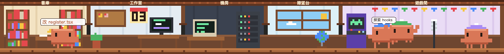
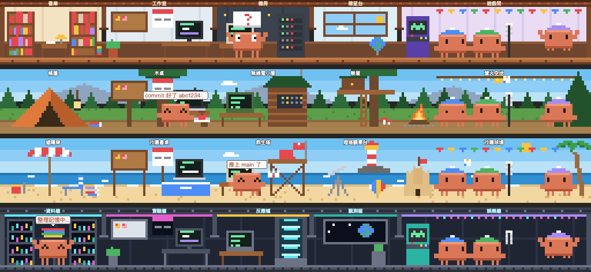
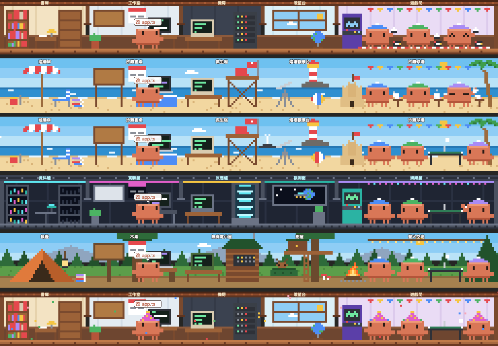
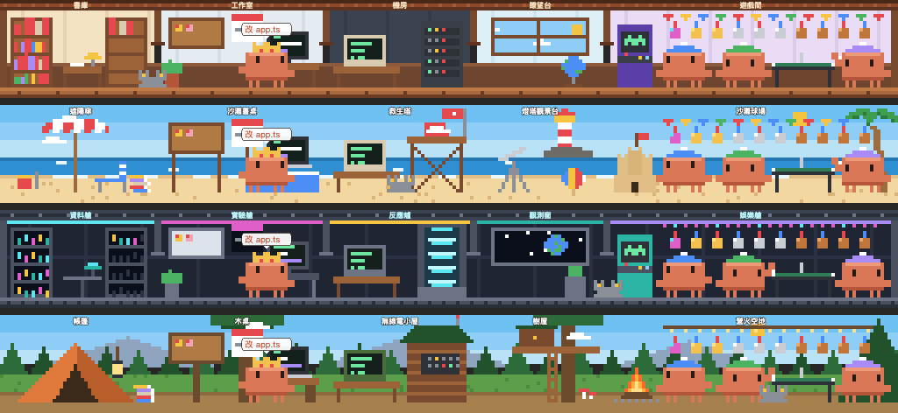
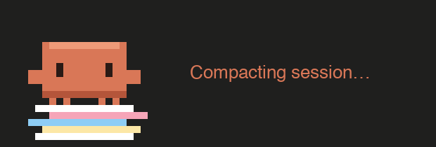
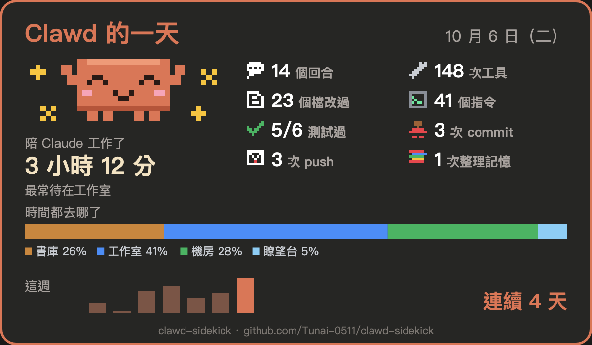

# Clawd 副駕（Clawd Sidekick）

**住在 Claude Code 輸入框上方的 Clawd 像素小屋。** Claude 在做什麼，Clawd 就走到對應的房間去做，他的夥伴們則在遊戲間玩。小屋下面是平常要看狀態列才知道的數字。**完全不耗 token**：Clawd 不會呼叫模型，也不會把任何東西放進你的對話。

[English](./README.md)



## 功能

**小屋**：五個房間的剖面，靈感來自 [ClawLibrary（龍蝦圖書館）](https://github.com/shengyu-meng/ClawLibrary)。

| 房間 | Clawd 什麼時候去 |
| --- | --- |
| 書庫 | Claude 讀檔、搜尋檔案時 |
| 工作室 | 改檔、想事情時；布告欄和日曆上是你的截止日 |
| 機房 | 跑指令時 |
| 瞭望台 | 上網查資料時（窗外跟著你當地的時間：白天、黃昏、星空） |
| 遊戲間 | 沒事的時候；夥伴們住這裡 |

**四個場景**：按橫條上的「場景」按鈕，或打 `/clawd scene beach` 就能切換。每個場景都有一樣的五個區域，所以 Clawd 們在哪裡的行為都一樣：

- **小屋**：書庫、工作室、機房、瞭望台、遊戲間
- **海灘**：遮陽傘、沙灘書桌、救生塔、燈塔觀景台、有沙堡的沙灘球場
- **太空站**：資料艙、實驗艙、反應爐、觀測窗、娛樂艙
- **森林營地**：帳篷、木桌、無線電小屋、樹屋、營火空地


**三隻戴毛帽的夥伴**（藍、綠、紫）：

- Claude 工作時打**排球**
- 閒著時每 90 秒換一個遊戲：**桌球加電玩**、**跳繩**、**疊積木**
- 晚上 11 點到早上 7 點蓋被子睡覺
- **每個子代理會借走一隻**：他放下遊戲，走到子代理正在用的那個房間，頭上冒泡泡寫著在做什麼，做完再回來玩。剩下的人數不夠時，會自動換成適合的遊戲。


**場景會反映真正發生的事**：不用看數字，看場景就知道現在的狀況。四個場景都有：

- **書庫＝Claude 的記憶**：context 用得越多，小屋書架上的書越滿（滿到堆在地上），太空站的資料水晶一顆顆亮起來，海灘和營地的書越疊越高。對話被壓縮時，Clawd 會捧著一疊書去整理，書架隨後跟著清空。
- **跑測試**：`npm test`、`pytest`、`go test`、`cargo test` 這類測試通過時 Clawd 歡呼，沒過時他冒冷汗。
- **Git**：commit 會蓋上紅色印章；push 或開 PR 時，他把一封封好的信寄出去；PR 合併時他歡呼。git 和 gh 做了什麼是 Claude Code 直接告訴 mod 的，不是從輸出猜的。
- **等你批准**：Clawd 舉起一塊寫著「?」的大牌子貼在玻璃上。
- **5 小時額度快用完時**（超過 80%），每隻 Clawd 都眼皮沉重，偶爾打個哈欠。



**Clawd 們的日常**：
- 夥伴們照你的時間過日子：中午 12 點野餐吃午餐，下午 3 點喝下午茶，Claude 在工作也一樣。
- Claude 連續工作 50 分鐘沒停，Clawd 會伸懶腰，也提醒你起來動一動。
- 偶爾（一天幾次）會出現稀有景象，持續一分半：
  - 天暗時劃過的流星
  - 小屋窗台上的麻雀
  - 海灘遠方噴水的鯨魚
  - 太空站窗外飛過的 UFO
  - 營地樹叢後探頭的鹿
- 看到這些會算進成就。



**變成你的 Clawd**：
- `/clawd name 小橘` 幫主 Clawd 取名，`/clawd name 1 小藍` 幫夥伴取名。
- `/clawd cap 1 red` 換夥伴的帽子顏色。
- 每個專案會記住你上次選的場景。
- `/clawd birthday 10/31` 設定生日，那天大家都戴派對帽，滿場飄彩紙。

**Git 安全網**：
- 數字列顯示專案目前的分支、比遠端多或少幾個 commit，以及有幾個檔案還沒提交。
- 未提交超過半小時會變黃；超過兩小時或累積到 20 個檔案會變紅。
- Claude 改的檔案放了一個小時還沒 commit，回合之間 Clawd 會蓋章提醒「該 commit 了」，告訴你有幾個檔案和幾個還沒 push 的 commit。

**這一輪改了什麼**：打 `/clawd changes`，或在 `/clawd` 面板按「改了什麼」，會列出：
- 這個 session 裡 Claude 改過或新增的每個檔案、加減了幾行，這一回合動過的會標一個點。
- 跑過的指令，以及成功（✓）或失敗（✗）。

commit 前看一眼很方便。

**對話裡的 Clawd**：桌面版裡，工具執行中時，那一列是抱筆電打字的 Clawd。做完後換成一隻小 Clawd（成功時開心，失敗時緊張），旁邊寫著做了什麼，還有一個展開鈕，可以看指令和輸出的前幾行。

**鄰居**：同時開了好幾個 Claude Code 嗎？其他 session 的 Clawd 會來串門子。
- 最多兩位正在工作的鄰居會從右邊走進來，站到他的 Claude 正在做的事對應的房間。
- 鄰居戴著不同顏色的帽子，頭上泡泡寫著他的專案名。
- 他停下來或 session 關掉，就會走出去。
- 下方那排數字會列出隔壁有哪些 session。
- 資料只透過這個 plugin 在你電腦上的儲存區交換，不會傳出去。

**成就**：21 類、共 78 個目標，大多分銅、銀、金、傳說四級。從第一次 commit，到連續開工 100 天、100 萬次工具呼叫、單一回合 3 小時。
- 每一類達成後，遊戲間的彩旗下就多掛一面獎牌。
- 部分等級送主 Clawd 一頂帽子（派對帽、王冠、光環、巫師帽…），或一隻在地上散步的夥伴（貓咪、貓頭鷹、小螃蟹），或把 commit 的印章和 push 的封蠟換成金色。
- `/clawd trophies` 看每一類目前的等級和進度，`/clawd hat`、`/clawd pal` 選要戴哪頂帽子、帶哪隻夥伴。
- 裝上之前已經有的工作紀錄也會算進去。



<details>
<summary>全部成就</summary>

| 成就 | 條件 | 銅 | 銀 | 金 | 傳說 |
| --- | --- | --- | --- | --- | --- |
| 連續開工 | 連續幾天都有開工 | 3 天 | 7 天＋派對帽 | 30 天＋王冠 | 100 天＋貓咪 |
| 開工天數 | 有開工的天數，累計 | 10 天 | 50 天 | 200 天 | 365 天＋光環 |
| Commit | Commit 次數 | 1 | 100 | 1,000＋金色印章 | 5,000 |
| Push | Push 次數 | 1 | 50 | 500＋金色封蠟 | 2,000 |
| 測試通過 | 測試通過的次數 | 1 | 100 | 1,000＋學士帽 | 10,000 |
| 測試全綠 | 測試連續通過的次數（中間沒有失敗） | 5 | 25 | 100 | 500 |
| 工具呼叫 | 工具呼叫次數 | 1,000 | 10,000 | 100,000＋耳機 | 1,000,000 |
| 改檔 | 改檔次數 | 100 | 1,000 | 10,000 | 50,000 |
| 整理記憶 | 對話被壓縮（整理記憶）的次數 | 1 | 10 | 50＋巫師帽 | 200 |
| 派出子代理 | 派出的子代理 | 10 | 100 | 1,000＋船長帽 | 5,000 |
| 夜貓子 | 半夜 0 點到 5 點開始的回合 | 1 | 25 | 100＋貓頭鷹 | 500 |
| 早起的鳥 | 早上 5 點到 7 點開始的回合 | 1 | 25 | 100＋小花 | 300 |
| 工作馬拉松 | 單日最長的工作時間 | 4 小時 | 8 小時 | 12 小時 | 16 小時 |
| 長回合 | 最長的單一回合 | 10 分 | 30 分 | 60 分 | 180 分 |
| 最忙的一天 | 單日最多工具呼叫 | 300 | 1,000 | 3,000 | 10,000 |
| 摸摸 Clawd | 你摸 Clawd 的次數 | 10 | 100 | 1,000＋小螃蟹 | 10,000 |
| PR 合併 | 合併的 PR | 1 | 25 | 100 | 500 |
| 環遊四景 | 住過的場景 | — | 4＋探險帽 | — | — |
| 節日也上工 | 節日也上工（農曆新年、萬聖節、聖誕節） | 1 | 2 | 3 | — |
| 稀有景象 | 看過的稀有景象（流星、每個場景的訪客） | 1 | 3 | 5 | — |
| 逆轉勝 | 測試連續失敗 3 次以上之後又通過 | 1 | 10 | 50 | — |

</details>

**季節、節日**：場景跟著你那邊的日曆變化，全世界都適用，不用連網。

- **季節**：照你當地的日期。春天樹上開花、花瓣飄落；秋天森林轉紅金色、落葉紛飛；冬天每隻 Clawd 都圍上圍巾。在南半球季節會自動顛倒：Clawd 看你電腦的時區（例如 `Australia/Sydney`、`America/Sao_Paulo`）判斷你在赤道哪一邊。
- **節日**：農曆新年掛紅燈籠，萬聖節擺南瓜、戴巫師帽，聖誕節放聖誕樹、戴聖誕帽。


**光影**：桌面版的每個房間都有自己的燈和螢幕在發光：
- 檯燈周圍有柔和的光暈，每個螢幕微微發亮，白天的光從窗戶照進來，黃昏整個場景偏暖色。
- 天黑後房間變暗，只剩亮著的燈附近是亮的；每隻 Clawd 腳下都有淡淡的影子。
- 空氣也會動：小屋窗邊的光線裡有灰塵飄、太空站窗外的星星會閃、海面有反光、森林營地天黑後有螢火蟲。

**滑鼠互動（桌面版）**：
- 移到房間上，那個房間會亮起來，並浮出一張卡片：這個房間是做什麼的、現在有什麼（書庫是 Claude 的記憶、布告欄是你的截止日、機房是 git 狀態、瞭望台是窗外、遊戲間是獎牌），還有一個開關燈的按鈕。
- 關燈的房間會變暗、螢幕熄掉、檯燈不再發光，每個場景、每個 session 都一樣。也可以打 `/clawd lights off`，終端機也適用。
- 移到 Clawd 身上會冒愛心，卡片寫著他在做什麼，還有「摸摸」按鈕。

系統開啟「減少動態效果」時，桌面版的場景會停在靜止畫面，雲、落葉、灰塵都不會飄，火光也不會閃。

**終端機**：小屋最寬可以畫滿 256 欄，視窗比較窄時畫面會跟著 Clawd 移動。每一格都用自己的背景色塗滿，所以不會因為終端機的行距露出橫條紋。關燈的房間和天黑後的小屋在終端機裡一樣會變暗。



**Clawd 版 Thinking 列**：「Thinking…」那一列變成一隻小 Clawd。思考時冒點點，Claude 開始工作時他就坐到筆電前打字，旁邊的秒數每秒跳。壓縮對話時，他會跳上一疊亂紙，一路踩成綁紅繩的紙包。桌面版裡，工具執行中時，對話裡那個工具的那一列也會換成他在打字。沒在工作時，他會待在輸入框下方那行提示上：輪到你時揮手，深夜睡著，旁邊顯示上次回覆花多久和今天總共工作多久。這兩行旁邊都是 Claude Code 自己的英文，所以不論語言設定都固定顯示英文。

**今日戰報**：打 `/clawd recap`，或在 `/clawd` 面板按「今日戰報」，會出現一張今天的卡片，內容包括：
- 陪 Claude 工作了多久
- 回合、工具、改過的檔、指令、測試通過、commit、push、整理記憶的次數
- 時間花在哪些房間
- 這週每天的狀況，以及連續工作了幾天

同一台電腦上所有 session 和專案都會算進去。卡片設計成適合截圖分享的樣子。



**即時數字**：模型、context 用量、5 小時和 7 天額度、花費，以及「這次回覆」：Claude 處理你最新那則訊息花了多久（閒下來時是上次回覆花了多久），和其中用了幾次工具、改了幾個檔、跑了幾個指令。超過 50% 變黃，超過 80% 變紅；額度用超過 70% 時，會加註還有多久重置。收合時只留一行：Clawd 在做什麼、context、5 小時額度、這次回覆、git 和最近的截止日。

**額度守門員**：5 小時或 7 天額度用到 80%、95%、100% 時，Clawd 會提醒你一次（跳出通知，泡泡也會顯示），告訴你用了多少、什麼時候重置。快用完又有沒 commit 的改動時，會建議你先 commit。同一個額度週期只提醒一次，開幾個 session 都一樣。

**Session 結算**：打 `/clawd summary`，或在 `/clawd` 面板按「結算」，會出現這個 session 到目前為止的卡片：陪 Claude 工作了多久、回覆幾次、用了幾次工具、改了哪些檔（加減幾行）、跑了幾個指令（幾個失敗）、測試、commit、push、花費，還有改最多的檔案。Session 結束時會跳出通知，下次在同一個專案開 session 時也會先顯示一次。

**截止日雷達**：`/deadline add 12/24 發表會` 會在橫條和牆上日曆顯示倒數，布告欄也會多一張便利貼，顏色代表有多緊急。剩不到 3 天 Clawd 會冒汗；剩不到 24 小時日曆會閃紅燈，他會慌張。

**中英切換**：預設跟著系統語言，隨時可以按橫條上的按鈕，或打 `/clawd lang zh|en|auto` 切換。

## 安裝

需要支援 mod 的 Claude Code：終端機 **v2.1.287 以上**，桌面 app 的 Code 分頁 **v2.1.286 以上**。我們在 2.1.288 上測試過。

```bash
claude plugin marketplace add Tunai-0511/clawd-sidekick
claude plugin install clawd-sidekick@clawd-sidekick
```

也可以在 session 裡直接安裝：

```
/plugin install clawd-sidekick --marketplace Tunai-0511/clawd-sidekick
```

裝好之後，在已開的 session 執行 `/reload-plugins`，或開一個新的 session。

### 自動更新

第三方 marketplace 預設不會自動更新，作者也沒辦法替你打開。請自己開一次：
1. 執行 `/plugin`
2. 進入 **Marketplaces**
3. 選 **clawd-sidekick**
4. 選 **Enable auto-update**

之後新版本會在背景下載，下次開 Claude Code 就是新版。沒開的話，想更新時執行 `claude plugin update clawd-sidekick@clawd-sidekick`。

## 指令

| 指令 | 用途 |
| --- | --- |
| `/clawd` | 打開面板：大 Clawd、所有截止日、今日戰報和成就 |
| `/clawd changes` | 這個 session 改過的每個檔案（加減行數）和跑過的每個指令（✓／✗） |
| `/clawd recap` | 今日戰報：工作時間、各項數字、各房間的時間、這週、連續天數 |
| `/clawd summary` | Session 結算：工作時間、回覆、改過的檔、指令、commit、花費 |
| `/clawd lights off`、`on`、`off library` | 開關燈，可以全部或單一房間（library、codelab、terminal、web、game） |
| `/clawd trophies` | 每一類成就：目前等級、進度、下一級會拿到什麼 |
| `/clawd hat 名稱`、`auto`、`none` | 戴上已解鎖的帽子（`auto` 戴最好的那頂） |
| `/clawd pal 名稱`、`auto`、`none` | 選在地上散步的夥伴 |
| `/clawd name 名字`、`name 1 名字`、`name reset` | 幫主 Clawd 或夥伴（1–3）取名 |
| `/clawd cap 1 red` | 換夥伴（1–3）的帽子顏色：blue、green、purple、red、yellow、teal、pink |
| `/clawd birthday 10/31`、`off` | 生日那天戴派對帽、飄彩紙 |
| `/clawd scene house`、`beach`、`space`、`forest`、`next` | 讓 Clawd 們搬到別的場景 |
| `/clawd season winter`、`auto` | 手動指定季節，或跟著日期 |
| `/clawd holiday christmas`、`lunar`、`halloween`、`none`、`auto` | 手動指定節日佈置，或跟著日期 |
| `/clawd hide`、`/clawd show` | 把橫條收成一行，或展開 |
| `/clawd lang zh`、`en`、`auto` | 切換語言（`auto` 跟著系統） |
| `/deadline` | 列出截止日；也可以 `add 12/24 名稱`、`add 2027-03-01 09:00 名稱`、`add 明天 名稱`、`rm N` |

## 設定（`/config`）

| 設定 | 預設 | |
| --- | --- | --- |
| `language` | `auto` | `auto`、`en` 或 `zh-TW` |

## 它在你電腦上做什麼

mod 是用你的權限在跑，所以這裡列出它碰到的所有東西（`claude plugin validate .` 列出的也一樣）：

- **模型呼叫和 token：完全沒有。** Clawd 不會呼叫模型，不會改系統提示或工具結果。指令的回應用彈出通知顯示，不會寫進對話，所以模型讀不到。執行 `/clawd` 或 `/deadline` 指令時，對話裡只會留下那個指令本身的一行紀錄，跟任何斜線指令一樣。
- **執行程式**：啟動時各跑一次 `date +%z` 和 `readlink /etc/localtime` 取得時區，用來判斷時間和南北半球。語言設成 `auto` 又沒有 `LANG` 時，在 macOS 上跑一次 `defaults read -g AppleLanguages`。另外，每 30 秒以及 Claude 改檔或跑指令之後，會在專案資料夾裡跑 `git status --porcelain -b` 和 `git log -1 --format=%ct`，只讀不寫，給 Git 安全網用。
- **儲存**：截止日、場景、語言、被摸的次數、你取的名字、帽子顏色和生日、每個專案的場景、戰報用的每日數字、成就用的累計數字、哪些房間關了燈、已經提醒過哪些額度（按額度週期記）、每個專案上一次的 Session 結算（顯示一次就刪掉），以及每個開著的 session 留給鄰居的狀態（專案名和在做什麼，session 結束就刪掉），存在你電腦上這個 plugin 自己的儲存區。舊版功能留下的資料，會在 session 開始時刪掉。
- **環境變數**：讀取 `LANG`、`LC_ALL`、`LC_MESSAGES`、`TZ`。
- **網路：完全不連網。**

## 開發

```bash
claude --plugin-dir .          # 這個 session 載入這個資料夾，存檔就熱重載
claude plugin validate .
claude plugin test .
```

### 新增場景

一個場景就是 `hooks/themes.ts` 裡 `THEMES` 的一筆資料。它的型別 `ThemeArt` 規定每一項都必填：
- 場景本身的畫法和會動的部分
- 滑鼠移上去會亮的燈和會打招呼的玩具
- 天空和房間名稱的樣式
- `memory`：書庫那一區用來表示 context 用量的東西
- `glows`、`isIndoor`、`hasDaylight`：每個房間有哪些東西會發光，以及場景怎麼變暗

少一項，型別檢查就不會過。測試「what happens shows in every scene」還會讓每個場景跑過所有記憶等級和所有事件（舉牌、蓋章、寄信、整理、歡呼、冒汗）。任何一個沒顯示出來，或 SVG 超過大小限制，測試就會失敗。

## 致謝

靈感來自 [ClawLibrary](https://github.com/shengyu-meng/ClawLibrary)。Clawd 是 Anthropic 的 Claude Code 吉祥物。這是非官方的粉絲作品，與 Anthropic 無關，也未經其背書。

MIT 授權。
